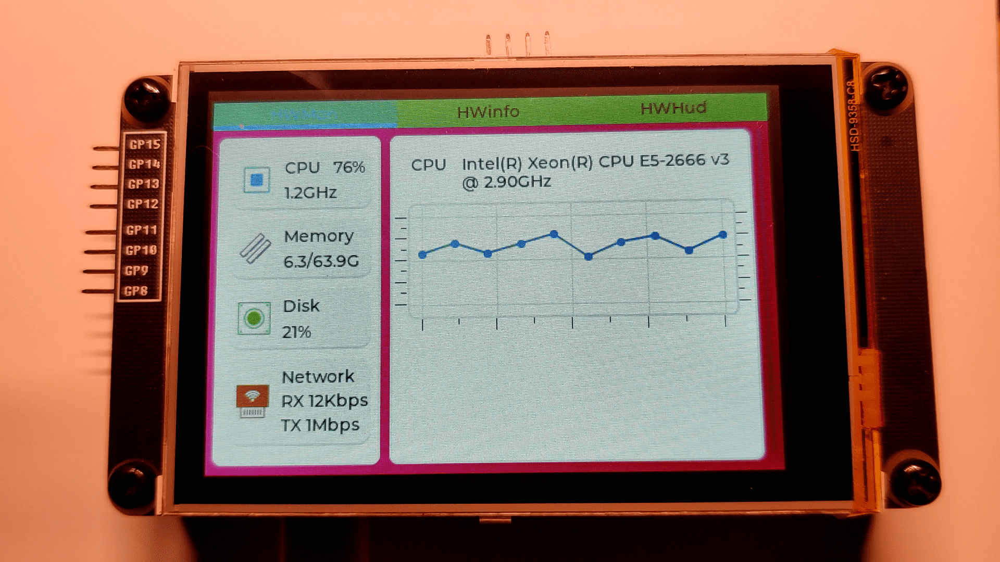
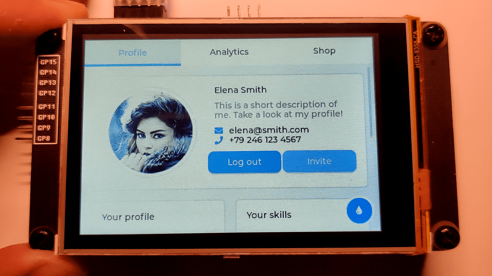
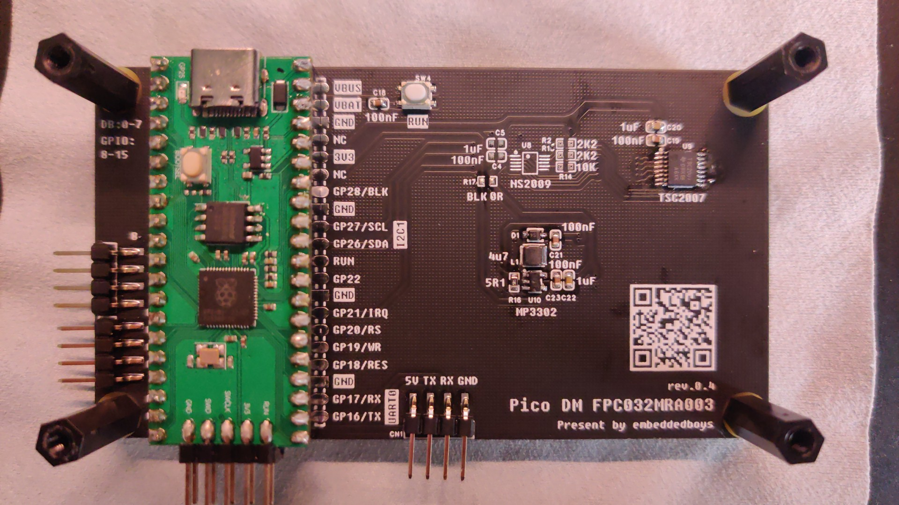

> <h1 align="center"> <strong>Pico DM FPC032MRA003</strong> </h1>

`文档链接` : [`http://embeddedboys.com/Pico_DM_FPC032MRA003`](http://embeddedboys.com/Pico_DM_FPC032MRA003)

`项目仓库` : [`https://gitee.com/embeddedboys/pico_dm_fpc032mra003_freertos`](https://gitee.com/embeddedboys/pico_dm_fpc032mra003_freertos)

 

> <h1 align="center"><strong>"最具性价比的LVGL开发板之一"</strong></h1>

<!-- 这里可以放项目的预览图 -->

<!-- ## <h2 align="center">简介</h2> -->

<!-- 有关项目的简短介绍 -->
<!-- > <h3 align="center" ><strong>Pico_DM_FPC032MRA003</strong></h3> -->

<h3 align="center">隆重的向大家介绍 <strong>Pico_DM_FPC032MRA003</strong>, 这是一款基于树莓派 Pico 核心板设计的一款低成本显示拓展板，分辨率为480x320，专用于学习、评估、开发LVGL或其他GUI应用。</h3>

<h3 align="center">文档还在持续更新中，如果更新不够及时，可以先临时参考另外一个项目的文档</h3>

<a href="http://embeddedboys.com/Pico_DM_QD3503728">http://embeddedboys.com/Pico_DM_QD3503728</a>

<!-- 

&nbsp&nbsp&nbsp&nbspPico_DM_FPC032MRA003 是 XXXXX

 -->

## <h2 align="center">实机演示</h2>
<!-- 快速简短的GIF玩法展示 -->
  
  
  

> 
器件以实物为准

## <h2 align="center">技术规格</h2>

<!-- 有关设备资源的表格 -->

| 组件       | 型号                          |
|------------|-------------------------------|
| 系统       | FreeRTOS SMP             |
| 核心板        | 树莓派Pico |
| 屏幕       | 3.2寸 R61581 非IPS      |
| 触摸屏 | 3.2寸 TSC2007 电阻屏 |
| 背光 | MP3302D |
| GPIO | GP8 ~ GP15 |

## <h2 align="center">许可证</h2>

此项目发布于`MIT`许可证下，更多详细信息，请查看`关于->许可证`

## <h2 align="center">致谢</h2>
<!-- 对该项目做出贡献的组织或个人 -->

玩得开心！  
干杯, 
zheng  

<h2 align="center">
      
    
</h2>
<h2 align="center">
    <a href="https://embeddedboys.github.io/">embeddedboys</a> 献上
</h2>
